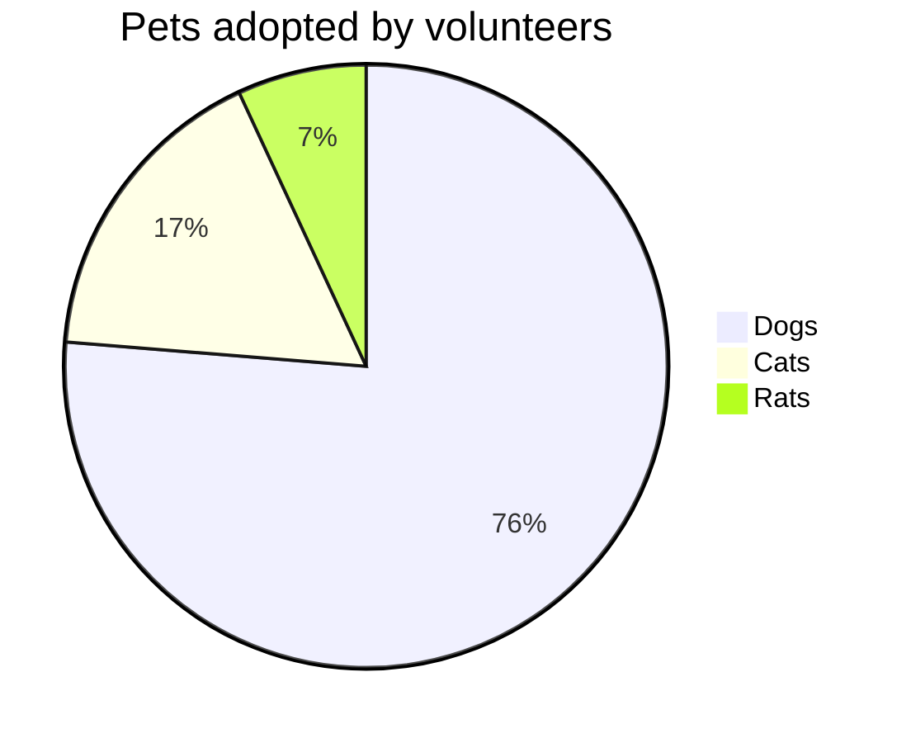

### Bio

Name: Sövény Gergely Máté (aka. @SukuWc)

Z,θ: Budapest, Hungary

Coffee: Yes please!

Hardware design engineer: Yes

Firmware developer: Yes

TV repair technician: No

### More Information

For the past 7 years I have been working on the development of the Intech Studio Grid: a seamlessly extendible modular MIDI controller solution. During this time I have worked on multiple other hardware project both as a design engineer and a tech advisor.

Open Hardware Legacy is an archive for liberated design files, alternate or reverse engineered firmware and all things necessary to maintain end-of-life hardware projects.

Some great projects end up ultimately failing in the free market, but existing users have the right to enjoy, modify and repair their devices. My mission is to archive and celebrate the work done by the original designers, enable users to use their product after it has been stopped being supported, and educate engineers and product developers on responsible product lifecycle practices. 

### Diagram

### Contact me and I will help convince you to... 
- Open source as much of your project as possible
- Only use open source tooling
- Setup CI/CD for firmware
- Setup CI/CD for CAD and Electrical CAD/EDA

[soveny@intech.studio](mailto:soveny@intech.studio)
